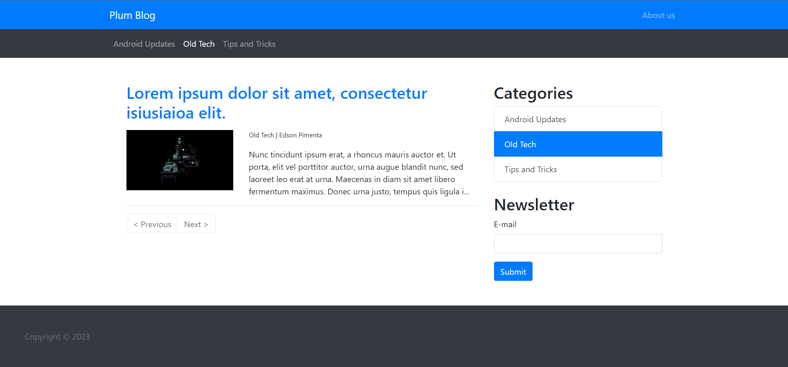
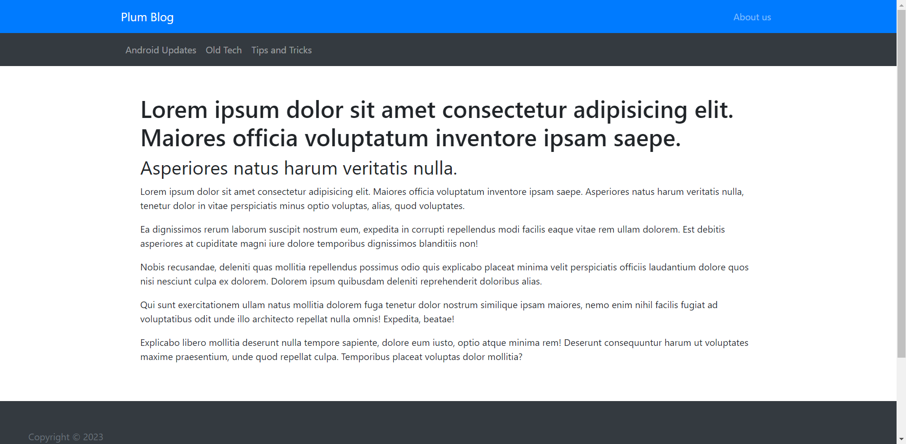
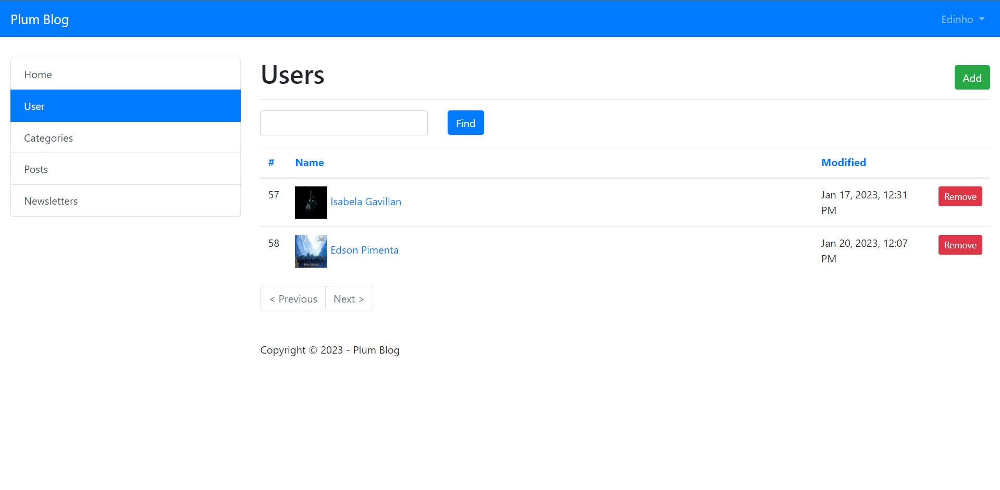
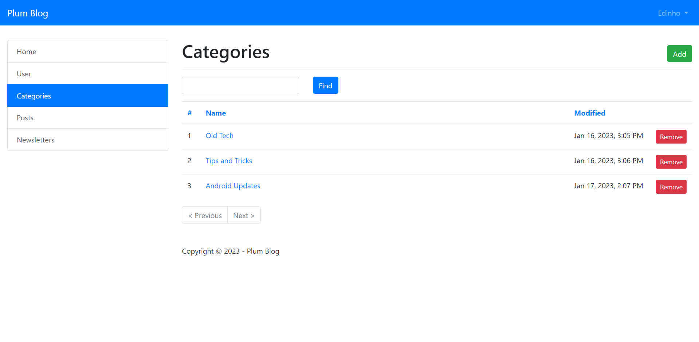
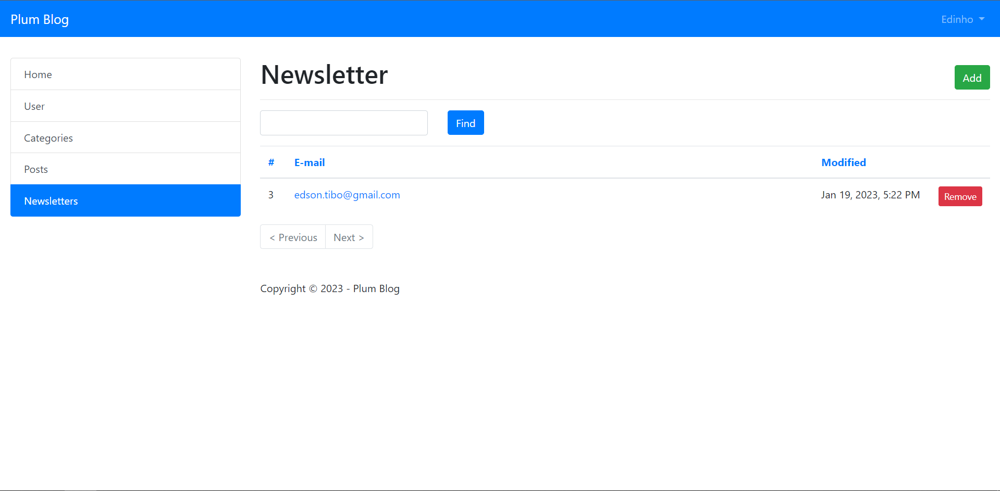

# Plum Blog

Blog desenvolvido em CakePHP para fins de estudo e fixação dos conceitos e convenções do Framework para PHP.

## Tecnologias utilizadas:

    

E CakePHP 4.

## Previews

> ### Homepage
> 
> ### View by category
> 
> ### About Us page
> 
> ### User admin panel
> 
> ### Category admin panel
> 
> ### Newsletters admin panel
> 

## Licença

Distribuído sobre a licença MIT. Veja `LICENSE` para mais informações.

## Meta

Edson Pimenta:
- [Gmail](mailto:dev.eddyyxxyy@gmail.com?)
- [Github](https://github.com/eddyyxxyy)
- [LinkedIn](https://www.linkedin.com/in/eeddyyxxyy/)
- [Youtube](https://www.youtube.com/channel/UCIISJihJOYOBj-4oZhW3pSw)
